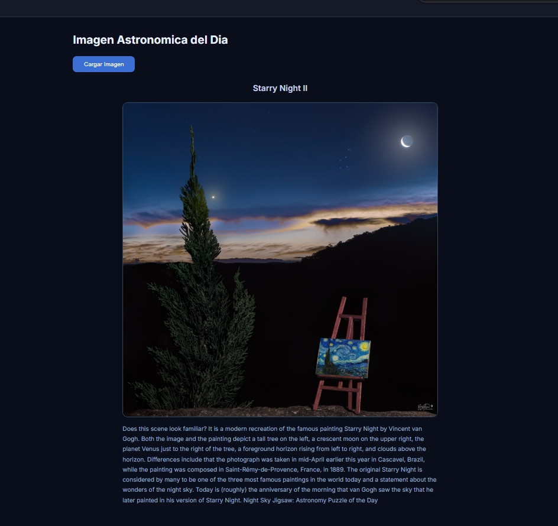

# NASA Explorer

**Nombre del camper:** Lesli Zuñiga

---

## Descripción breve

**NASA Explorer** es una aplicación web interactiva que permite explorar datos astronómicos en tiempo real directamente desde las APIs oficiales de la NASA.

---

## ¿Qué hace la app?

La aplicación cuenta con tres secciones principales:

| Sección | Descripción |
|---|---|
| **Imagen del Día (APOD)** | Muestra la imagen astronómica del día junto con su título y descripción, obtenida desde la API APOD de NASA. |
| **NEO - Objetos Cercanos a la Tierra** | Lista los asteroides y objetos cercanos a la Tierra usando la API NeoWs de NASA. |
| **EPIC - Imágenes de la Tierra** | Galería de imágenes satelitales de la Tierra captadas por la cámara EPIC del satélite DSCOVR. |

### APIs utilizadas

Todas las secciones consumen datos de la **NASA Open APIs**:

- **APOD** (Astronomy Picture of the Day)
- **NeoWs** (Near Earth Object Web Service)
- **EPIC** (Earth Polychromatic Imaging Camera)

**Documentación oficial de la API:** [https://api.nasa.gov/](https://api.nasa.gov/)

---

## Captura de pantalla




---

## Instrucciones para ejecutarlo localmente

### Requisitos previos

- Navegador web moderno (Chrome, Firefox, Edge, etc.)
- Conexión a internet (para consumir la API de NASA)
- Una API Key de NASA (puedes obtener una gratis en [https://api.nasa.gov/](https://api.nasa.gov/))

### Pasos

1. **Clona el repositorio:**
   ```bash
   git clone <URL-del-repositorio>
   cd api.nasa
   ```
2. **Configura tu API Key:**

   Abre los archivos JavaScript (ase.js, 
ovedades.js, curiosidades.js) y reemplaza el valor de la variable API_KEY con tu clave personal:
    
   ```js
   const API_KEY = 'TU_API_KEY_AQUI';
   ```

3. **Abre la aplicación en el navegador:**

   Navega a la carpeta Astronomia.api/ y abre el archivo menu.html o index.html directamente en tu navegador:
   ```bash
   Astronomia.api/menu.html
   ```
   O bien, si tienes instalada la extensión **Live Server** en VS Code, haz clic derecho sobre menu.html y selecciona **Open with Live Server**.

4. **¡Listo!** Explora las secciones: Imagen del Día, NEO y EPIC.
